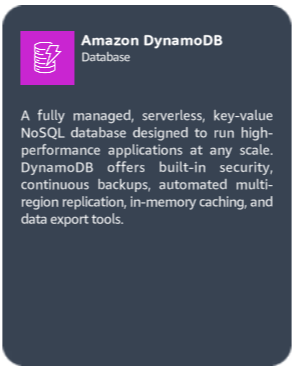

# Cloud Practitioner

Você aprenderá sobre conceitos da AWS Cloud, conceitos de segurança, casos de uso comuns, modelos de cobrança e precificação e impactos comerciais.

Você pode ganhar um distintivo digital por concluir todas as tarefas do Cloud Practitioner. Os distintivos digitais do AWS Cloud Quest permitem que você demonstre seu conhecimento em criação de soluções.



***

## <mark style="color:red;">**Objetivos de aprendizagem**</mark>

Para cada tarefa, você receberá uma conta automatizada para criar uma nova solução no console da AWS.

***

***

***

### <mark style="color:red;">Computing Solutions</mark>

| Título da tarefa       | Solicitação de negócios                                                                                                                            |
| ---------------------- | -------------------------------------------------------------------------------------------------------------------------------------------------- |
| Soluções de Computação | O servidor da escola que executa a solução de agendamento precisa de mais memória. Auxilie no dimensionamento vertical da instância do Amazon EC2. |

<mark style="color:purple;">Alterando o tipo de familia de instancia para melhor performance.</mark>

Descreva famílias de instâncias e tipos de instâncias do Amazon EC2. Descreva o dimensionamento horizontal e vertical.

1. Reconhecer opções para conectar-se a instâncias do Amazon EC2.

* [x] &#x20;Explore Amazon EC2 instance types.
* [x] Filter EC2 instances based on their attributes.
* [x] Connect to an EC2 instance using Amazon EC2 Session Manager
* [x] View EC2 instance metadata using the instance public IP address.
* [x] Start and stop an EC2 instance by using the Amazon EC2 console.

***

<mark style="color:purple;">**Step 1**</mark>

1. On the top navigation bar, review the Region selector to ensure that the Region is set to N. Virginio (us-east-1).
2. In the Services search box, type: EC2
3. In the search results, under Services, click EC2.
4. Go to next step

 (1).png>)

<mark style="color:purple;">**Step 2**</mark>

1. In the left navigation pane, click instances.
2. Go to the next step

<mark style="color:red;">**Concepts:**</mark> Amazon Elastic Compute Cloud (Amazon EC2) instances provide virtual compute capacity in the cloud. With a choice of processor, storage, networking, operating system, and purchase model the service offers a broad and deep solution.

 (1).png>)

<mark style="color:purple;">**Step 3**</mark>

1. In the instances section, choose the check box to select the AWS Computing Solutions instance.
2. Click the Details tab.
3. Review the details.
4. Go to the next step

<mark style="color:red;">**Concepts**</mark>: Information about the instance (such as its public IP, private IP, and public DNS) is displyaed in the instance summary section by selecting the EC2 instance.

 (1).png>)

<mark style="color:purple;">**Step 4**</mark>

1. in the left navigation pane, click Instance Types.
2. Go to the next step

<mark style="color:red;">**Concept:**</mark> Amazon EC2 provides a wide selection of instance types that belong to instance families that are optimized to fit different use cases.

 (1).png>)

<mark style="color:purple;">**Step 5**</mark>

1. In the Instances types section, in the filter box, type the fllowing and press Enter after each:

* t3.large
* c5.large
* r5.large

2. Choose the three check boxes to select each added instance types.
3. Go to the next step

<mark style="color:red;">Concept:</mark> Each instance type includes one or more instance sizes, so you can scale your resources to the requirements of your target workload.

 (1).png>)

<mark style="color:purple;">**Step 6**</mark>

1. For each instance types, review the instance details.
2. To compare compute, networking, storage, accelerators, and pricing information, scroll down.
3. In the left navigation pane, click instances.
4. Go to the next step

<mark style="color:red;">**Concept:**</mark> Using the Amazon EC2 console, you can filter instance attributes such as instance types, instance family, and instance size. You can search using keyworkds, atribute names, or expressions.

 (1).png>)

<mark style="color:purple;">**Step 7**</mark>

1. Choose the check box to select the AWS Computing Solutions instances.
2. On the details tab, under Public IPv4 address, click the copy icon to copy the provided address.

* Do not use the "open address" link

3. Go to the next step

<mark style="color:red;">**Concept:**</mark> Instance metadata is data about your instance that you can use to configure or manage the running instance. Instance metadata is divided into categories; for exemple, host name, events, and securiy groups.

 (1).png>)

<mark style="color:purple;">**Step 8**</mark>

1. Open a new browser tab, and then paste the IP Address that you just copied and press Enter (not shown).
2. Review the instance details, and then return to the previous browser.

* You should land on the instance page in the Amazon EC2 Console.

3. Go to the next step.

<mark style="color:red;">**Concept:**</mark> When creeating a new insntace, you can enable the instance metadata service (IMDS) through the Advanced details sections. This way, you can display attibute details by using the instance's public IP.

 (1).png>)

<mark style="color:purple;">**Step 9**</mark>

1. In the instances section, click Connect.
2. Go to the next step

<mark style="color:red;">**Concept:**</mark> You have the flexibility to connect to an EC2 instance by using Amazon EC2 Instance Connect, Session Manager (a capability of AWS Systems Manager), or an SSH client.

 (1).png>)

<mark style="color:purple;">**Step 10**</mark>

1. Click EC2 Instance Connect tab.
2. Review the connection settings.
3. Click the Session Manager tab.
4. Go to the next step

<mark style="color:red;">**Concept:**</mark> EC2 Instance Connect provides an efficient and secure way to connect to your Linux instances. EC2 Instance Connect uses AWS Identity and Access Management (IAM) policies and principals to control SSH access to you instances, removing the need to share and manage SSH keys.

.png>)

<mark style="color:purple;">**Step 11**</mark>

1. Review the Session Manager usage details.
2. Click the SSH client tab.
3. Go to the next step

<mark style="color:red;">**Concept:**</mark> Using Session Manager, you can manage your EC2 instances through an interactive one-click, browser-based shell or through the AWS Command Line Interface (AWS CLI). After the session begins, you can run bash commands as you would through any other connection type.

.png>)

<mark style="color:purple;">**Step 12**</mark>

1. Review the requirements for connecting through SSH.
2. Click to go back to the Session Manager tab.
3. Go to the next step.

<mark style="color:red;">**Concept:**</mark> You can connect to your instance by using an SSH client on your local device through your instance key pair. Your device might have an SSH client by default or you might need to install an SSH client.

.png>)

<mark style="color:purple;">**Step 13**</mark>

1. Click connect, and then wait for the terminal window to open.
2. Go to the next step.

<mark style="color:red;">**Concept:**</mark> Session Manager provides secure and auditable node management without the need to open inbound ports, maintain bastion hosts, or manage SSH keys. Session Manager also allows you to comply with corporate policies that require controlled access to managed nodes, strict security practicesm and fully auditable logs with node access details, while providing end users with simple onde-click cross-platform access to your managed nodes.

.png>)

<mark style="color:purple;">**Step 14**</mark>

1. To provide root privileges to the current session, in the terminal window, at the command prompt, run the following command (type the command and press Enter):  `sudo -i`
2. To change to the application directory, run: `cd ../home/ec2-user/sample-app`

* Be sure to add a space between `cd` and the `../` command.
* A sample application resides on this instance.

3. To view the files in the sample\_app directory, run: `ls`
4. To check the instance log, run: `tail -lf aws_compute_solutions.log`

<mark style="color:red;">**Concept:**</mark> After you are connected to the instance, you can control the instance by using AWS CLI command. The command prompt behaves as if you are connected locally.

.png>)

<mark style="color:purple;">**Step 15**</mark>

1. Review the log details.

* To quit, press CTRL + C on your keyboard.

2. Close the terminal tab to return to the instances page in the Amazon EC2 console.
3. Go to the next step.

.png>)

<mark style="color:purple;">**Step 16**</mark>

1. Click Actions to expand the dropdown menu.
2. Choose Instance settings.
3. Choose Edit user data.
4. Go to the next step

<mark style="color:red;">**Concept:**</mark> You can use the Actions dropdown menu to control the instance state and modify instance attributes.

.png>)

<mark style="color:purple;">**Step 17**</mark>

1. Under Current user data, review the commands.
2. Click Cancel.
3. Go to the next step

<mark style="color:red;">**Concept**</mark>**:** You can also use instance metadata to access user data that you specified when launching your instance.

.png>)

<mark style="color:purple;">**Step 18**</mark>

1. In the left navigation pane, click instances.
2. In the Instances section, click Instance state to expand the dropdown menu.
3. Choose Stop instance.
4. Go to the next step.

<mark style="color:red;">**Concept:**</mark> Using the instance state dropdown menu, you can place an instance into different states of activity. You can start and stop an instance if it has an Amazon Elastic Block Store (Amazon EBS) volume as its root device.

.png>)

<mark style="color:purple;">**Step 19**</mark>

1. In the pop-up box, click Stop.
2. Go to the next step

<mark style="color:red;">**Concept:**</mark> Afteran instance stops, CPU usage and data transfer charges cease, but storage charges for any attached Amazon EBS volumes continue.

.png>)

<mark style="color:purple;">**Step 20**</mark>

1. Review the successfully stopped banner.
2. On the Details tab, after the instance state changes to Stopped, review the Public IPv4 address and DNS.

* They should both be empty. You may need to click the refresh button under the banner to see the empty settings.

3. Go to the next step.

<mark style="color:red;">**Concept:**</mark> Each time you start a stopped instance, AWS charges a minimum of one minutes for the use of per-second billing instances. After one minute, AWS charges only for the seconds that you use.

.png>)

<mark style="color:purple;">**Step 21**</mark>

1. In Actions to expand the dropdown menu.
2. Choose instance settings.
3. Review the available options.

* You have different options to change your instance, such as type, termination protectionm and shutdown behavior.

4. Go to the next step.

<mark style="color:red;">**Concept:**</mark> You must stop your Amazon EBS-backend instance before you can change its instance type. Plan for downtime while your instance is stopped. Stopping the instance and changing its instance type might take a few minutes, and restarting your instance might take a variable amount of time depending on your application's startup scripts.

.png>)

<mark style="color:purple;">**Step 22**</mark>

1. Click Instance state to expand the dropdown menu.
2. Choose Start Instance.
3. Go to the next step

.png>)

<mark style="color:purple;">**Step 23**</mark>

1. After the instance reaches the Running state, review the instance details.

* Node that the public IPv3 address and DNS are now populated.

2. Go to the next step.

.png>)

Finished.

#### <mark style="color:blue;">DAP - Arquitetura da solução</mark>

<figure><figcaption></figcaption></figure>

***

### <mark style="color:red;">Networking Concepts</mark>

| Título da tarefa  | Solicitação de negócios                                                                                      |
| ----------------- | ------------------------------------------------------------------------------------------------------------ |
| Conceitos de rede | Ajude o banco a configurar um ambiente de rede seguro que permita a comunicação entre recursos e a internet. |

<figure><figcaption></figcaption></figure>

<mark style="color:purple;">Configurando trafico de redes de forma segura no Amazon VPCs</mark>

Defina os principais recursos de VPCs, sub-redes, gateways de internet e tabelas de rotas. Descreva os benefícios de usar Amazon VPCs. Declare os conceitos básicos de notação de bloco CIDR e endereçamento IP.&#x20;

1. Explique como o tráfego VPC é roteado e protegido usando gateways, listas de controle de acesso à rede e grupos de segurança.

* [x] Explore the components that comprise a virtual private cloud (VPC)
* [x] Configure a route table attached to a subnet within a VPC.
* [x] Configure an internet gateway inside a VPC.
* [x] Configure inbound rules within a security group to control access.

***

<mark style="color:purple;">**Step 1**</mark>

1. On the top navigation bar, review the Region selector to ensure that the Region is set to N. Virginio (us-east-1).
2. In the Services search box, type: EC2
3. In the search results, under Services, click EC2.
4. Go to next step

<mark style="color:red;">**Concept:**</mark> AWS launched its very first Amazon Elastic Compute Cloud (Amazon EC2) instance in August, 2006.

 (1).png>)

<mark style="color:purple;">**Step 2**</mark>

1. In the left navigation pane, click instances.
2. Go to the next step

 (1).png>)

<mark style="color:purple;">**Step 3**</mark>

1. In the instances section, choose the check box to select Web Server instance.
2. On the Details tab, under Public IPv4 address, click the copy icon to copy the provided addredd.
3. Go to the next step

 (1) (1).png>)

<mark style="color:purple;">**Step 4**</mark>

1. In a new browser tab, paste the IP Address that you just copied and press Enter.

* After a few minutes, a site timeout message will appear.

2. To solve this issue return to the previous browser (the Instances page in the Amazon EC2 console).
3. Go to the next step

 (1) (1).png>)

<mark style="color:purple;">**Step 5**</mark>

1. In the instances section, choose the check box to select the Web Server instance.
2. Click the Networking tab.
3. Review the Public and Private IIPv4 address.
4. Go to the next step

<mark style="color:red;">**Concepts**</mark>: Using Amazon Virtual Private Cloud (Amazon VCP), you can launch AWS resources into a virtual network closely resembles a traditional network that you'd operate in you own data center, with the benefits of using the scalable infrastructure of AWS.

 (1) (1).png>)

<mark style="color:purple;">**Step 6**</mark>

1. Under Subnet ID, click the provided ID.
2. Go the next step

<mark style="color:red;">**Concepts**</mark>: A subnet is a range of IP addresses in your VPC. You can launch AWS resources into a specified subnet. Each subnet must reside entirely within one Availability Zone and cannot span zones.

 (1) (1).png>)

<mark style="color:purple;">**Step 7**</mark>

1. In the Subnets section, choose the check box to select the network-concepts subnet.
2. Click the Route table tab.
3. Next to Route table, click the link name that contains web-server-netSubnet1

<mark style="color:red;">**Concepts**</mark>: A route table contains a set of rules, called routes, that are used to determine where network traffic from your subnet or gateway is directed. Use a public subnet for internet-connected resources and a private subnet for resources not connected to the Internet.

 (1) (1).png>)

<mark style="color:purple;">**Step 8**</mark>

1. In the Route tables section, choose the check box to select the network-concepts route table.
2. Click the Routes tab.
3. Review the two route table entries.

* One route sends local traffic to the local network only, and the other route sends all other traffic to the internet through a NAT gateway.

4. Click Edit routes.
5. Go to the next step.

<mark style="color:red;">**Concepts**</mark>: The CIDR naming convention 0.0.0.0/0 represents all IPv4 address (::/0 for IPv6).

 (1).png>)

<mark style="color:purple;">**Step 9**</mark>

1. To delete e NAT gateway from the route table, click Remove.
2. Go to the next step.

<mark style="color:red;">**Concepts**</mark>: A NAT gateway is a network address translation (NAT) service. With a NAT gateway, instances in a private subnet can connect to services outside your VPC. External services cannot initiate a connection with those instances.

 (1).png>)

<mark style="color:purple;">**Step 10**</mark>

1. Click Add route.
2. To configure the new route, for Destination, type: 0.0.0.0/0
3. For Target, choose Internet Gateway.
4. Choose igw-xxxxxxx(network-concepts/VPC).
5. Click Save changes.
6. Go to the next step

<mark style="color:red;">**Concepts**</mark>: An internet gateway serves two purposes:

* Provide a target in your VPC route tables for internet-routable traffic.
* Perform network address translation (NAT) for instances that have been assigned public IPv4 addresses.

 (1).png>)

<mark style="color:purple;">**Step 11**</mark>

1. On the Routes tab, review the new internet gateway association.

* The subnet is now reachable from the internet.

2. Navigate to the Instances page on the Amazon EC2 console.

* Remember, on the top navigation bar, you can use the Services search box (or click Services) to navigate to a different service console

3. Go to the next step

<mark style="color:red;">**Concepts**</mark>: An internet gateway supports IPv4 and IPv6 traffic. It does not cause availability risks or bandwidth constraints on your network traffic. There's no additional charge for having an internet gateway in you account.

 (1).png>)

<mark style="color:purple;">**Step 12**</mark>

1. In the felt navigation pane, click instances.
2. In the Instances section, choose the check box to select the Web Server instance.
3. Click the Security tab.
4. Under Security groups, click WebServerSecurityGroup
5. Go to the next step

 (1).png>)

<mark style="color:purple;">**Step 13**</mark>

1. On the Inbound rules tab, click Edit inbounds rules.
2. Go to the next step

<mark style="color:red;">**Concepts**</mark>: For each security group, you can add rules that control the traffic based on protocols and port numbers. Separate sets of rules exist for inbound traffic and outbound traffic.

 (1).png>)

<mark style="color:purple;">**Step 14**</mark>

1. Click Add rule
2. Go to the next step

<mark style="color:red;">**Concepts**</mark>: When you create a VPC, it comes with a default security group. You can create additional security groups for each VPC.

 (1).png>)

<mark style="color:purple;">**Step 15**</mark>

1. In the Inbound rules section, for Type, click the search box to expand the dropdown menu.
2. Scroll down to see the varius predefined protocols available.

* You can see MYSQL/Aurora protocol on the dropdown menu, which you will use in the upcoming DIY section of this solution.

3. Choose HTTP.
4. Go to the next step.

<mark style="color:red;">**Concepts**</mark>: You can create a security group and add rules that reflect the role of the instance that is associated with the security group. For example, an instnace that is configured as a web server needs security group rules that allow inbound HTTP and HTTPS access. Likewise, a database instance needs rules that allow access for the type of database, such as access over port 3306 for MySQL.

 (1).png>)

<mark style="color:purple;">**Step 16**</mark>

1. For Source, choose Anywhere-IPV4.
2. Review the recommended setting warning alert.
3. Click Save rules.
4. Go to the next step

<mark style="color:red;">**Concepts**</mark>: Security groups are stateful. For example, if you send request from an instance, the response traffic for that request is allowed to reach the instance regardless of the inbound security group rules. Responses to allowed inbound traffic are allowed to leave the instance, regardless of the outbound rules.

 (1).png>)

<mark style="color:purple;">**Step 17**</mark>

1. In the left navigation pane, click Instances.
2. Go to the next step.

 (1).png>)

<mark style="color:purple;">**Step 18**</mark>

1. In the Instances section, choose the check box to select the Web Server instance.

* This will test connectivity using a Java application.

2. Click the Networking tab.
3. Under Publick IPv4 address, click the copy icon to copy the provided address.
4. Go to the next step

.png>)

<mark style="color:purple;">**Step 19**</mark>

1. In the new browser tab, paste the instance IP address that you just coiped and press Enter.
2. Review the application that loads from the publick IP address.
3. Review the connection from the internet to the Web Server.

* A connection should be established.

4. Review the connection from the Web Server to the DB Server.

* A connection from the Web Server to the DB Server sould display as failed.

5. Go to the next step

<mark style="color:red;">**Concepts**</mark>: To deploy a working internet gateway, the following must be completed:

* The internet gateway must be attached to a VPC
* Route tables associated with your public subnet must have a route to your internet gateway.
* Security groups associated with your VPC must allow traffic to/from the internet.
* Any instances in the VPC must have a public IP or Elastic IP address assigned.

.png>)

Finished.

***

### <mark style="color:red;">Databases in Practice</mark>

| Título da tarefa          | Solicitação de negócios                                                                            |
| ------------------------- | -------------------------------------------------------------------------------------------------- |
| Bases de dados na prática | Melhore as operações, o desempenho e a disponibilidade do banco de dados relacional da seguradora. |

<figure><figcaption></figcaption></figure>

<mark style="color:purple;">Gerenciamento de banco de dados com Amazon RDS</mark>

Revise os recursos, benefícios e tipos de banco de dados disponíveis com o Amazon RDS. Descreva o dimensionamento vertical e horizontal no Amazon RDS. Use réplicas de leitura do Amazon RDS para aumentar o desempenho do banco de dados.&#x20;

1. Implemente implantações multi-AZ do Amazon RDS para aumentar a disponibilidade.

* [x] Launch an Amazon RDS instance.
* [x] Configure a Multi-AZ deploymnet
* [x] Configure Amazon RDS backups.

***

<mark style="color:purple;">**Step 1**</mark>

1. In the top navigation bar search box, type: RDS
2. In the search results, under Services, click RDS.
3. Go to the next step

.png>)

<mark style="color:purple;">**Step 2**</mark>

1. In the left navigation pane, click Databases.
2. In the Databases section, click Create database.
3. Go to the next step

<mark style="color:red;">**Concept:**</mark> Amazon Relational Database Service (Amazon RDS) is a managed service. This  means that your database administrator can focus on innovating instead of patching and updating their database and infrastructure.

Amazon RDS is optmized for memory, performance, and input/output. With Amazon RDS, you only pay for the resources that you actually consume.

.png>)

<mark style="color:purple;">**Step 3**</mark>

1. To fine-tune your configuration, for Choose a database creation method, choose Standard create.
2. For Engine type, choose MariaDB.
3. Go to the next step.

<mark style="color:red;">**Concept:**</mark> AWS offers several familiar database (DB) engines. Amazon Aurora, a lightning fast database solution at AWS, is up to five times faster than MySQL and three times faster than PostgreSQL. Aurora databases are highly secure, available, and durable.

&#x20;.png>)

<mark style="color:purple;">**Step 4**</mark>

1. For Engine Version, keep the default MariaDB version provided.

* The default version might be different from what is displayed in the screenshot example.

2. For Templates, choose Dev/Test.
3. Go to the next step

<mark style="color:red;">**Concept:**</mark> Amazon RDS provides three templates for you deployment: Production, Dev/Test, and Free Tier. Use Free Tier if you wish to learn or deploy a quick proof of concept. Use Production only when deploying a production-level system

.png>)

<mark style="color:purple;">**Step 5**</mark>

1. For DB instance identifier, type: my-database

* This is the name of your DB instance.

2. For Master username, keep the default username of admin.
3. For Credentials management, choose Self managed
4. For Master password, type: ILoveLearning!123
5. For Confirm password, type the password again.
6. Go to the next step

<mark style="color:red;">**Concept:**</mark> You DB instance identifier is the name that you see when you search for your instance in the console. You can connect this database with the credentials that you provide here.

.png>)

<mark style="color:purple;">**Step 6**</mark>

1. Scroll down to instance configuration
2. For DB Instance class, choose Burstable classes.
3. On the dropdown menu below that, choose db.t3.xlarge

* Only t3 db classes are supoported in this lab.

4. For Storage type, on the dropdown menu, choose General Purpose SSD (gp2).
5. For Allocated storage, type: 20
6. Go to the next step

<mark style="color:red;">**Concept:**</mark> Amazaon RDS supports the most demanding database applications. You can choose between two SSD-backed storage options. One is optimized for high performance OLTP applications, and the other is optimize for cost-effective, general-purpose use.

.png>)

<mark style="color:purple;">**Step 7**</mark>

1. For Storage autoscaling, chick the expand arrow.
2. Review the default option of Enable storage autoscaling.
3. For Maximum storage threshold, review the default threshold of 1000GB.
4. Under Availability & durability, for multi-AZ deployment, choose Create a standby instance.
5. Go to the next step

<mark style="color:red;">**Concept:**</mark> Using the MySQL, MariaDB, Oracle, and PostgreSQL engines, you can scale up to 64 TB of storage. SQL Server supports up too 16 TB. Storage scaling is on the fly, with zero downtime.

.png>)

<mark style="color:purple;">**Step 8**</mark>

1. In the Connectivity section, for Virtual private cloud (VPC), keep the default value of Default VPC.
2. For DB subnet group, keep the default setting.
3. For Public access, keep the default setting.
4. For VPC security group (firewall), keep the default setting.
5. Go to the next step

<mark style="color:red;">**Concept:**</mark> Amazon RDS helps you control network access to you database. You can also run your RDS DB instances in a virtual private cloud (VPC). This way, you can isolate your DB instances and connect to you existing IT infraestructure through an industry standard encrypted IPsec VPN.

.png>)

<mark style="color:purple;">**Step 9**</mark>

1. In the Monitoring section, for Performance insights, clear the check box to deselect Turn on Performance Insights.
2. For Additional configuration, click the expand arrow.
3. For Enhanced Monitoring, clear the check box to deselect Enable Enhanced monitoring.

* If either Performance Insights or Enhanced monitoring are enabled, you'll get a permissions error when trying to create the database.

4. Scroll down to the Additional configuration section.
5. Go to the next step.

.png>)

<mark style="color:purple;">**Step 10**</mark>

1. In the Additional configuration section, for Additional configuration, click de expand arrow.
2. For Initial database name, type: my\_database
3. For DB parameter group and Option group, review the default options.
4. Under Backup, review the default options.
5. Go to the next step

<mark style="color:red;">**Concept:**</mark> In order for AWS to sucessfully provision an RDS DB instance for you, you must first specify an initial database name. if you failt to spacify an initial database, your instance can still be provisioned, but it might not work properly.

.png>)

<mark style="color:purple;">**Step 11**</mark>

1. In the Additional configuration section, for Encryption, review the default option of Enable encryption.
2. Go to the next step

.png>)

<mark style="color:purple;">**Step 12**</mark>

1. For Maintenance, clear the check box to deselect Enable auto minor version upgrade.
2. For Maintenance window, review the default selection of No preference
3. Scroll down and click Create database (not shown).
4. Go to the next step.

.png>)

<mark style="color:purple;">**Step 13**</mark>

* Expect about 15-20 minutes to create your RDS instance. It's a great time to get a cup of coffe or a snack!
* You may see a pop-up window. Please close it.

1. When you return, in the Databases section, click the refresh icon.
2. Under Status, review to ensure that the DB status is Available.
3. Click my-database.
4. Go to the next step

.png>)

<mark style="color:purple;">**Step 14**</mark>

1. Click Actions to expand the dropdown menu.
2. Review the different options.

* The options, such as Create read replica, can be used to manage your existing DB instance.

3. Go to the next step.

.png>)

***

DIY Activities

* [x] Create a read replica of your primary database using a db.t3.xlarge instance

.png>)

***

***

### <mark style="color:red;">Connecting VPCs</mark>

| Título da tarefa | Solicitação de negócios                                                                                                        |
| ---------------- | ------------------------------------------------------------------------------------------------------------------------------ |
| Conectando VPCs  | A equipe de marketing da cidade quer Amazon VPCs separadas para cada departamento que permita a comunicação entre Amazon VPCs. |

<figure><figcaption></figcaption></figure>

<mark style="color:purple;">Estabelecendo conexão de peering de VPC</mark>

Resuma como o peering de VPC funciona com o Amazon VPC. Explique as etapas para estabelecer uma conexão de peering de VPC. Crie uma conexão de peering entre dois Amazon VPCs.&#x20;

1. Estabeleça uma conexão de peering entre Amazon VPCs usando uma sub-rede específica.

* [ ] Set up a VPC peering connection
* [ ] Ensure that traffic is internally routed within this connection.

***

<mark style="color:purple;">**Step 1**</mark>

1. In the navigation bar search box, type: VPC
2. In the search results, under Services, click VPC.
3. Go to the next step.

<mark style="color:red;">**Concept**</mark>: Amazon Virtual Private Cloud (Amazon VPC) is a service that helps you launch AWS resources in a logically isolated virtual network that you define. You have complete control over you virtual networking environment.

.png>)

<mark style="color:purple;">**Step 2**</mark>

1. In the left navigation pane, click Your VPCs.
2. In the your VPCs section, review the Marketing, Finance, and Developer VPCs.
3. Go to the next step

<mark style="color:red;">**Concept**</mark>: By default, VPCs are isolated from each other. A VPC peering connection is a networking connection between two VPCs that you can use to route traffic between them by using private IP address.

.png>)

<mark style="color:purple;">**Step 3**</mark>

1. In the top navigation bar search box, type: EC2
2. In the search results, under Services, click EC2
3. Go to the next step.

.png>)

<mark style="color:purple;">**Step 4**</mark>

1. In the Resources section, click Instances (running).
2. Go to the next step.

.png>)

<mark style="color:purple;">**Step 5**</mark>

1. In the Instances section, choose the check box to select the FinanceServer instance.
2. On the Details lab, review to see that no Public IPv4 address or DNS is populated for FinanceServer.

* This is because the server was created in a private subnet.

3. Under Private IPv4 addresses, click the copy icon to copy the provided IP address for FinanceServer, and then paste it in the text editor of your choice on your local device.

* You will use this value in later steps.

4. Scroll down to Subnet ID
5. Go to the next step

.png>)

<mark style="color:purple;">**Step 6**</mark>

1. Under Subnet ID, review the provided ID.

* Note that the subnet is private (FinancePrivateSubnet)

2. Go to the next step.

.png>)

<mark style="color:purple;">**Step 7**</mark>

1. To view the details of the MarketingServer instance, clear the check box to deselect the FinanceServer instance, and then choose the check boc to select the MarketingServer instance.
2. On the Details tab, under VPC ID, review the VPC that the MarketingServer instance belongs to
3. In the Instance section, click Connect.
4. Go to the next step

<mark style="color:red;">**Concept**</mark>: You can connect to an Amazon Elastic Compute Cloud (Amazon EC2) instance in four ways:&#x20;

* EC2 Insntace Connect
* Session Manager
* SSH client
* EC2 Serial Console

.png>)

<mark style="color:purple;">**Step 8**</mark>

1. Click the Session Manager tab.
2. Click Connect.

* The Session Manager terminal for the MarketingServer instance opens in a new browser tab (or window).

3. Go to the next step.

<mark style="color:red;">**Concept**</mark>: Session Manager is a fully managed AWS System Manager capability. With Session Manager, you can manage your Amazon EC2 instances, edge devices, and on-premises servers and virtual machines (VMs). You can use either an interactive one-click browser-based shell or the AWS Command Line Interface (AWS CLI).

.png>)

<mark style="color:purple;">**Step 9**</mark>

1. In the terminal window, replacing the current IP address with the IP address that you copied in an earlier step, run (type the command and press Enter) ping 172.31.x.xx

* This private IPv4 address is for the FinanceServer instance. This command checks the connection to the FinanceServer instance

2. Review to see that your command hangs, and there is no connection.
3. To exit the running process, on your keyboard, press CTRL + C
4. Go to the next step.

<mark style="color:red;">**Concept**</mark>: By default, VPCs cannot communicate with resources in other VPCs using private IPv4 addresses or IPv6 addresses. In our example, the FinanceServer instance doesn't have a public IP, so your VPCs don't know how to route data to private IP destinations outside of thir own private range.

.png>)

<mark style="color:purple;">**Step 10**</mark>

1. In the previous browser, in the Amazon EC2 Instances section, under Instance ID, click the MarketingServer instance ID.
2. Go to the nest step

.png>)

<mark style="color:purple;">**Step 11**</mark>

1. Under Subnet ID, click the provided ID.
2. Go to the next step

<mark style="color:red;">**Concept**</mark>: EC2 instances reside within a subnet. A subnet is a range of IP Addresses in your VPC.

.png>)

<mark style="color:purple;">**Step 12**</mark>

1. In the Subnets section, choose the check box to select the subnet name.
2. On the Details tab, under Route table, click the provided route ID.
3. Go to the next step

<mark style="color:red;">**Concept**</mark>: An important property of a subnet is its route table. A route table contains a set of rules, called routes. Routes are used to determine where network traffic, from your subnet or gateway, is directed.

.png>)

<mark style="color:purple;">**Step 13**</mark>

1. Under Route tables, choose the Marketing route table.
2. Click the Routes tab.
3. In the Routes section, review the routing rules.

* You should see two routes: one route for the local traffic and one route for the internet traffic through the internet gateway.

4. Go to the next step.

<mark style="color:red;">**Concept**</mark>: Routes tables will have rules for local traffic and public IP ranges if a gateway is attached. We recommend that you specify a CIDR block from the private IPv4 address ranges, as specifed in RFC 1918.

.png>)

<mark style="color:purple;">**Step 14**</mark>

1. In the left navigation pane, click Peering connections.
2. In the Peering connections section, click Create peering connection.
3. Go to the next step

<mark style="color:red;">**Concept**</mark>:  Instances in either VPC can communicate with each other as if they are in the same network.

.png>)

<mark style="color:purple;">**Step 15**</mark>

1. In the Peering connection settings section, for Name, type: Marketing <> Finance
2. For VPC ID (Requester), on the dropdown menu, choose the Marketing VPC.
3. For VPC CIDRs, review to ensure that the Marketing VPC has 10.10.0.0/16 as its CIDR range.
4. Scrool down to the bottom of the page.
5. Go to the next step

<mark style="color:red;">**Concept**</mark>: Your VPC will request that another VPC allow access to its resources. the VPC that makes the request is called the Requester. You can request access to VPCs from other AWS accounts.

.png>)

<mark style="color:purple;">**Step 16**</mark>

1. For VPC ID (Accepter), choose the Finance VPC.
2. For VPC CIDRs, review to ensure that the Finance VPC has 172.31.0.0/16 as it CIDR range.
3. Click Create peering connection.
4. Go to the next step.

.png>)

<mark style="color:purple;">**Step 17**</mark>

1. In the success alert, review the message.
2. Under Status, review to ensure that the status is Pending Acceptance by xxxxxx.
3. Click Actions to expand the dropdown menu.
4. Choose Accept request.
5. Go to the next step

<mark style="color:red;">**Concept**</mark>: To request a VPC peering connection with a VPC in your account, ensure that you have the IDs of the VPCs with which you are creating the VPC peering connection. You must both create and accept the VPC peering connection request yourself to activate it. if the peering connection is across accounts, both accounts must accept the connection to activate it.

.png>)

<mark style="color:purple;">**Step 18**</mark>

1. In the pop-up box, click Accept request.
2. Go to the next step

.png>)

<mark style="color:purple;">**Step 19**</mark>

1. In the success alert, review the message.
2. Under Status, review to see that the status is Active.
3. Go to the next step

.png>)

<mark style="color:purple;">**Step 20**</mark>

1. Return to the Instances section on the Amazon EC2 console. and then choose the check box to select the MarketingServer instance.
2. On the Details tab, under Subnet ID, click the provided ID.
3. Go to the next step

<mark style="color:red;">**Concept**</mark>: After you establish a peering connection, you must modify the route table associeated with each VPC. You must add a route into each route table to allow traffic to be routed to the peered VPC.

.png>)

<mark style="color:purple;">**Step 21**</mark>

1. In the Subnets section, choose the check box to select the available subnet.
2. Under Route table, click the provided route ID.
3. Go to the next step

.png>)

<mark style="color:purple;">**Step 22**</mark>

1. In the Route tables section, choose the Marketing route table.
2. Click the Routes tab.
3. Click Edit routes.
4. Go to the next step

.png>)

<mark style="color:purple;">**Step 23**</mark>

1. Click Add route.
2. To configure the route, for Destination, in the new search box, type: 172.31.0.0/16
3. For Target, in the dropdown box, choose Peering Connection.
4. Choose the peering connection target that contains Marketing <> Finance.
5. Click Save changes.
6. Go to the next step

.png>)

<mark style="color:purple;">**Step 24**</mark>

1. In the success alert, review the message.
2. Go to the next step

.png>)

<mark style="color:purple;">**Step 25**</mark>

1. Return to the Instance section on the Amazon EC2 console, and then choose the check boc to select the FinanceServer instance.
2. On the Details tab, under Subnet ID, click the provided ID.
3. Go to the next step

.png>)

<mark style="color:purple;">**Step 26**</mark>

1. In the Subnets section, choose the check box to select the available subnet.
2. On the Details tab, under Route table, click the provided route ID.
3. Go to the next step

.png>)

<mark style="color:purple;">**Step 27**</mark>

1. In the Route tables section, choose the Finance route table.
2. Click the Routes tab.
3. Click Edit routes.
4. Go to the next step.

<mark style="color:red;">**Concept**</mark>: The route tables for each VPC must be modified to allow traffic across the peering connection.

.png>)

<mark style="color:purple;">**Step 28**</mark>

1. Click Add route.
2. To configure the route, for Destination, in the new search box, type: 10.10.0.0/16
3. For Target, in the dropbox box, choose Peering Connection.
4. Choose the peering connection taget that contains Marketing <> Finance.
5. Click Save changes.
6. Go to the next step

.png>)

<mark style="color:purple;">**Step 29**</mark>

1. In the success alert, review the message.
2. Go to the next step.

.png>)

<mark style="color:purple;">**Step 30**</mark>

1. Return to the Amazon EC2 Instances section, and then choose the check box to select the MarketingServer instance.
2. Click Connect
3. Go to the next step.

.png>)

<mark style="color:purple;">**Step 31**</mark>

1. Click the Session Manager tab.
2. Click Connect
3. Go to the next step

.png>)

<mark style="color:purple;">**Step 32**</mark>

* The Session Manager terminal for the MarketingServer instance opens in a new browser  tab (or window).

1. In the terminal, replacing the current IP address with the IP address that you copied in an earlier step, run: ping 172.31.x.xx

* This private IPv4 address is for the FinanceServer instance.

2. Review to see that the ping command is still not working.
3. To exit the running process, on your keyboard, press CTRL + C.
4. Go to the next step

<mark style="color:red;">**Concept**</mark>:  Peered VPCs do not necessarily accept all data between them. Security features, such as network access control lists and security groups, still apply. Be sure to update them accordingly.

.png>)

<mark style="color:purple;">**Step 33**</mark>

1. In the previous browser, in the Amazon EC2 Instances section, choose the check box to select the FinanceServer instance.
2. Click the Security tab.
3. Under Security groups, click the provided security group name that contains FinanceServerSecurityGroup.
4. Go to the next step

<mark style="color:red;">**Concept**</mark>: Security groups do not automatically accept data from peered VPCs. You must update security groups to allow a peered VPC as an incoming source.

.png>)

<mark style="color:purple;">**Step 34**</mark>

1. Click the Inbound rules tab.
2. Click Edit inbound rules.
3. Go to the next step

<mark style="color:red;">**Concept**</mark>: Security groups are stateful. If you send a request from your instance, the responde traffic for that request is allowed to flow in regardless of the inbound rules. This also means that responses to allowed inbound traffic are allowed to flow out, regardless of the outbound rules.

.png>)

<mark style="color:purple;">**Step 35**</mark>

1. Click Add rule.
2. To configure the rule, for Type, in the new search box, choose Custom ICMP - IPv4.
3. For Source, in the new search box, type and choose: 10.10.0.0/16
4. Click Save rules.
5. Return to the Amazon EC2 Instance page, and then connect to the MarketingServer instance by using Session Manager (not shown).
6. Go to the next step.

<mark style="color:red;">**Concept**</mark>: Security group rules are always permissive. You can't create rules that deny access. Using security group rules, you can filter traffic based on protocols and port numbers.

.png>)

<mark style="color:purple;">**Step 36**</mark>

1. In the terminal, replacing the current  IP address with the IP address that you copied in an earlier step, run: ping 172.31.x.xx

* This private IPv4 address is for the FinanceServer instance.

2. Review the data.

* The MarketingServer instance should now be able to communicate with the FinanceServer instance.

3. To exit the Running process, on your keyboard, press CTRL + C
4. Go to the next step

<mark style="color:red;">**Concept**</mark>: Your services can communicate after your VPCs are peered and the security groups allow the corrent traffic. Remember, if you need to add different traffic types, you will have to change the inbound rules of your security groups.

.png>)

***

DIY Activite

* [x] Configure VPC peering between Developer and Finance department VPCs.

.png>)

|                                                                      |                                                                                                                                                              |
| -------------------------------------------------------------------- | ------------------------------------------------------------------------------------------------------------------------------------------------------------ |
| <ol start="7"><li>Primeiro banco de dados NoSQL</li></ol>            | Ajude o serviço de streaming de entretenimento da ilha a implementar um banco de dados NoSQL para desenvolver novos recursos.                                |
| <ol start="8"><li>Sistemas de arquivos na nuvem</li></ol>            | Ajude a agência de modelos de animais de estimação da cidade a compartilhar dados de arquivos sem provisionar ou gerenciar armazenamento.                    |
| <ol start="9"><li>Aplicações de autocura e dimensionamento</li></ol> | Ajude o café de jogos da cidade a implementar servidores de recuperação automática, restringindo os clientes a uma capacidade de provisionamento específica. |
| <ol start="10"><li>Aplicações Web de Alta Disponibilidade</li></ol>  | Ajude a agência de viagens a criar uma arquitetura de aplicativo web de alta disponibilidade.                                                                |
| <ol start="11"><li>Conceitos Básicos de Segurança</li></ol>          | Ajude a melhorar a segurança na bolsa de valores da cidade garantindo que os engenheiros de suporte possam executar somente ações autorizadas.               |
| <ol start="12"><li>Economia da Nuvem</li></ol>                       | A loja de pranchas de surfe da cidade precisa de uma estimativa de custo de uma arquitetura com uso variável de recursos.                                    |

| Objetivos de aprendizado                                                                                                                                                                                                                                                                                        |
| --------------------------------------------------------------------------------------------------------------------------------------------------------------------------------------------------------------------------------------------------------------------------------------------------------------- |
| <ol start="6"><li></li></ol>                                                                                                                                                                                                                                                                                    |
| <ol start="7"><li>Resuma os diferentes usos de bancos de dados comuns criados para propósitos específicos. Descreva os recursos e benefícios do Amazon DynamoDB. Interaja com os elementos e atributos de um banco de dados Amazon DynamoDB. Configure um banco de dados NoSQL com o Amazon DynamoDB.</li></ol> |
| <ol start="8"><li>Resuma as diferentes opções de armazenamento disponíveis na AWS. Resuma os principais recursos e benefícios do Amazon EFS. Identifique casos de uso comercial para o Amazon EFS. Configure endpoints do Amazon EFS para acessar o armazenamento centralizado.</li></ol>                       |
| <ol start="9"><li>Descreva os recursos de autocura e dimensionamento oferecidos pelos grupos de Auto Scaling. Crie um grupo de Auto Scaling com limites de recursos rígidos. Configure um grupo de Auto Scaling para responder a um evento baseado em tempo.</li></ol>                                          |
| <ol start="10"><li>Descreva os princípios para arquitetar aplicativos de alta disponibilidade. Resuma os benefícios de usar um AWS Application Load Balancer (ALB). Use grupos de Auto Scaling com balanceamento de carga e monitoramento de integridade.</li></ol>                                             |
| <ol start="11"><li>Descreva o processo de criação e as diferenças entre usuários, funções e grupos do AWS IAM. Revise a estrutura e os componentes das Políticas do AWS IAM. Resuma o Modelo de Responsabilidade Compartilhada da AWS e os programas de conformidade.</li></ol>                                 |
| <ol start="12"><li>Descreva como as estimativas de preços são obtidas. Use a Calculadora de Preços da AWS para estimar o preço de uma arquitetura da AWS.</li></ol>                                                                                                                                             |

<mark style="color:purple;">Challenges</mark>

.png>) (1).png>).png>)

<mark style="color:purple;">Services Cards Resources</mark>

.png>).png>).png>).png>) (1).png>) (1).png>) (1).png>).png>).png>).png>).png>).png>).png>).png>).png>).png>).png>).png>).png>).png>).png>).png>)

.png>).png>).png>)

***
