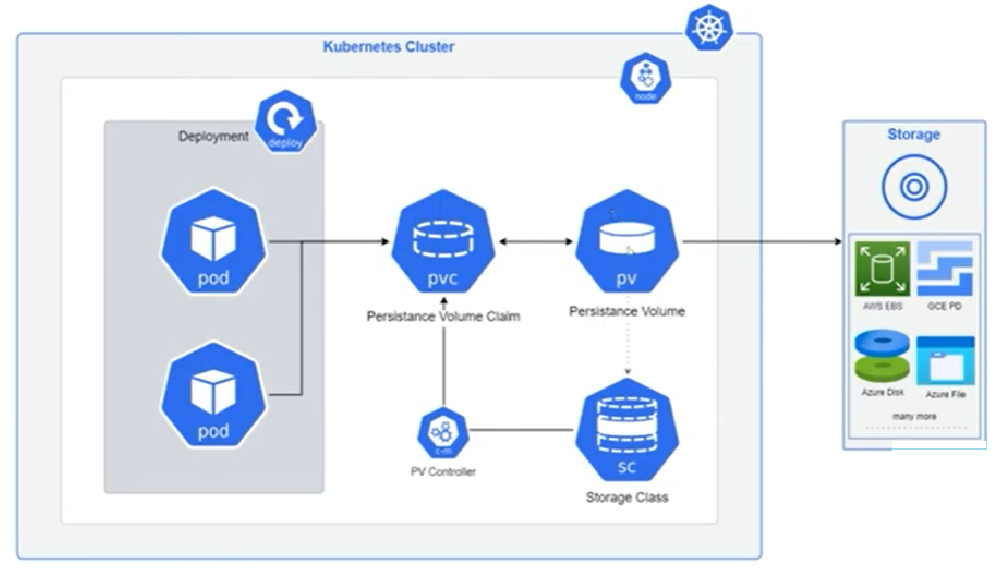

# Volumes




#### Todos os recursos utilizados nesses exemplos, estarão disponibilizados no Github:

[https://github.com/danncastro/nki-kubernetes-projects/tree/main/k8s-cka-exemples/pods](https://github.com/danncastro/nki-kubernetes-projects/tree/main/k8s-cka-exemples/pods)


***

## <mark style="color:red;">Overview</mark>

#### <mark style="color:blue;">Volume Abstraction</mark>

Suporta uma grande variedade de tipos de volumes, até mesmo volumes não suportados pelo Docker.

#### <mark style="color:blue;">Pod Volume Quantity Limit</mark>

Não há limite para quantidade de volumes que podem ser utilizados por um Pod

* Quando uma Pod é criada, um volume também é criado, isso é valido para volumes Ephemerals ou volumes Persistentes.
* Todos os containers implementados dentro da Pod, podem acessar, ler e gravar, os mesmo arquivos nesse volume.

#### <mark style="color:blue;">Ephemeral Volumes and Persistent Volumes</mark>

O Kubernetes trabalha com Volumes Ephemerals e Volumes Persistentes, no caso dos volumes Ephemeral, eles tem a vida util ligadas a vida util da Pod, ou seja quando uma Pod é removida os dados nesse Volume também seram.

#### <mark style="color:blue;">Volume Mount</mark>

Suporta montar sistemas de arquivos do tipo **tmpfs** - Temporary File System, que é um sistema de arquivos com suporte de RAM, armazenado na memória, que simula um disco, a vantagem de utilização do tmpfs, é  que se ganha uma grande velocidade, mas em contra partida é que tem um grande consumo de memória do container.

* Suporte a protocolos do tipo NFS e iSCSI&#x20;
* Suporta armazenamentos em nuvem, como Elastic Block Store(Amazon), Files and Disk Storage(Azure) e Persistent Disk(Google).

***

## <mark style="color:red;">**Ephemeral**</mark>

#### <mark style="color:blue;">**On-Disk-Files - Container:**</mark>&#x20;

São arquivos guardados em discos dentro dos proprios containers, ou seja não são persistentes.

O problema da utilização de volumes ephemerals é que no momento em que uma Pod quebra(crash) ou é reiniciada, faz com que o Kubelet coloque o container em um estado chamado clean-state, ou seja todos os dados gravados previamente dentro dos containers, são perdidos.

#### <mark style="color:blue;">Sharing Data Between Containers</mark>

Um outro problema da utilização de volumes Ephemerals é o caso de haver compartilhamento de dados entre containers detro da mesmo Pod, e essa Pod for reiniciada, os dados armazenados que foram perdidos, também não poderam ser acessados pelos outros containers.

* Volumes compartilhados entre containers da mesma Pod, podem ser montados em caminhos diferentes, como se fossem alias para uma mesma localização.

#### <mark style="color:blue;">EmptyDir</mark>

Volumes do tipo emptyDir são volumes Ephemeral, mas ainda assim esse tipo de volume, sobrevive a uma reinicialização de container, como uma falha de liveness por exemplo, ele só será removido se a Pod morrer.

* Podem ser armazenados em diversos tipos de mídia nos Workers-Nodes

***

### <mark style="color:red;">Criando Volumes Efêmeros - emptyDir</mark>



```bash
kubectl apply -f nki-kubernetes-projects/k8s_cka_exemples/pods/pods_volume_ephemeral.yml
```

pod/volume-ephemeral-pod created

***

```bash
watch kubectl get po -owide
```

<figure><figcaption></figcaption></figure>

***



1. Agora em outro terminal enquanto executa o watch, vamos conectar ao container criado

```bash
kubectl exec -it volume-ephemeral-pod bash
```

<figure><figcaption></figcaption></figure>

***

2. Vamos acessar o diretorio do volume montado, e criaremos um arquivo de exemplo lá.

```bash
echo "Hello Volume Ephemeral!" > volumeephetest.txt && cat volumeephetest.txt 
```

<figure><figcaption></figcaption></figure>

***



Para continuar os testes, precisamos instalar dentro do contianer o Procps, para validar os processos em execução dentro do container.

```bash
apt update && apt install procps -y
```

```bash
ps aux
```

<figure><figcaption></figcaption></figure>

***



1. Ainda com o comando `watch kubectl get po -owide` em execução em outro terminal vamos validar a aba restart para validarmos o teste de volumes ephemeral.

<figure><figcaption></figcaption></figure>

***

2.  De dentro do container vamos eliminar o processo do Redis que está em execução\


    <figure><figcaption></figcaption></figure>

***

<figure><figcaption></figcaption></figure>



1. Vamos acessar novamente o container para validar se o arquivo ainda estará lá

```bash
kubectl exec -it volume-ephemeral-pod bash
```

```
cat /volume-test/volumeephetest.txt
```

<figure><figcaption></figcaption></figure>

***

2. Vamos validar o que acontece em caso de deleção e recriação da Pod

```bash
kubectl delete po volume-ephemeral-pod
```

pod "volume-ephemeral-pod" deleted

```bash
kubectl apply -f nki-kubernetes-projects/k8s_cka_exemples/pods/pods_volume_ephemeral.yml
```

pod/volume-ephemeral-pod created

***

3 - Vamos acessar novamente o container e ver se o conteudo ainda está lá.

```bash
kubectl exec -it volume-ephemeral-pod bash
```

```bash
cd /volume-test
ls
```

<figure><figcaption></figcaption></figure>

***



```bash
kubectl delete po volume-ephemeral-pod
```

pod "volume-ephemeral-pod" deleted



***

## <mark style="color:red;">hostPath</mark>

É um tipo de volume que fornece persistência de dados, o que significa que os dados armazenados em um volume desse tipo permanecem disponíveis mesmo após o reinício de contêineres ou a remoção/recriação de pods, isso é possivel devido ao hostPath criar um volume no próprio disco do nó de trabalho (Worker Node) do cluster. Isso significa que os dados salvos em um hostPath volume, permanece lá até que o cluster ou o Worker Node seja removido, ou então até que os arquivos sejam removidos manualmente.

> _Por conta dos dados serem armazenados localmente no Worker Node, não são replicados automaticamente em outros nós. Isso significa que, se o pod for movido para outro nó, ele não terá acesso aos dados armazenados no hostPath do nó original, a menos que o volume seja montado em todos os nós ou os dados sejam movidos manualmente._

***

### <mark style="color:red;">Criando Volumes Persistente- hostPaths</mark>




```bash
kubectl apply -f k8s-hands-on-testing/k8s-cka-exemples/pods/pods_volumes_hostpath.yml
```

pod/volume-hostpath-pod created

***

```bash
watch kubectl get po -owide
```

<figure><figcaption></figcaption></figure>

***



1. Vamos executar o comando abaixo para conectar dentro do container

```bash
kubectl exec -it volume-hostpath-pod bash
```

<figure><figcaption></figcaption></figure>

***

2. Vamos acessar o diretorio do volume montado, e criaremos um arquivo de exemplo lá.

```bash
cd /data-persistent/ && \
echo "Hello Volume hostPath!" > volumehptest.txt && cat volumehptest.txt 
```

<figure><figcaption></figcaption></figure>

***



1. Vamos acessar o Worker Node ao qual a Pod foi designado, como mostrado anteriormente está no node `k8s-worker-node2`

```bash
ssh vagrant@ip_do_k8s-worker-node2
```

```bash
sudo -i
```

```bash
cat /var/lib/data-persistent/volumehptest.txt
```

<figure><figcaption></figcaption></figure>

***



1. Vamos deletar a Pod criada.

```bash
kubectl delete po volume-hostpath-pod
```

pod "volume-hostpath-pod" deleted

***

2. Podemos visualizar que mesmo após a deleção da Pod, o arquivo que foi mapeado para dentro do Worker Node 2, permanece lá.

<figure><figcaption></figcaption></figure>

***



1. Vamos recriar a Pod anteriormente destruida.&#x20;

```bash
kubectl apply -f nki-kubernetes-projects/k8s-cka-exemples/pods/pods_volumes_hostpath.yml
```

pod/volume-hostpath-pod created

***

2. Vamos novamente validar em qual Node a Pod foi criada

```bash
kubectl get po -owide
```

<figure><figcaption></figcaption></figure>

* Essa etapa de validação do Node, é importante pois caso a Pod tenha sido designada a um Nó diferente o arquivo não aparecerá onde está mapeado.

***

3. Agora vamos novamente acessar a Pod

```bash
kubectl exec -it volume-hostpath-pod bash
```

<figure><figcaption></figcaption></figure>

***

3. Podemos notar que o arquivo ainda estará lá no volume que foi montado de forma persistente.

<figure><figcaption></figcaption></figure>

***



```bash
kubectl delete po volume-hostpath-pod
```

pod "volume-hostpath-pod" deleted

***

```bash
kubectl get po
```

No resources found in default namespace.

***



***

## <mark style="color:red;">Persistent Storage</mark>

Quando falamos de armazenamento persistente em Kubernetes, precisamos entender dois recursos, o `PersistentVolumes` ou `PV` e o `PersistentVolumeClaim` ou `PVC`

#### <mark style="color:blue;">Persistent Volume ou PV</mark>

&#x20;`PVs` é um recurso de armazenamento virtual disponível no cluster, que aponta para um armazenamento físico na infraestrutura.

#### <mark style="color:blue;">Persistent Volume Claim ou PVC</mark>&#x20;

`PVCs` são solicitações de volume feitas pelo kubernetes que será atrelado a um APP.

<figure><figcaption></figcaption></figure>


Podemos resumir como `PV` sendo a unidade lógica atribuída a uma unidade de armazenamento físico que será disponibilizado para o kubernetes, e o `PVC` como a solicitação do kubernetes para que um volume com especificação `x` seja utilizado.



Um ponto importante a se notar é que o `PVC` sempre irá buscar o menor armazenamento possível que entregue todos os recursos que forem solicitados.


Caso um `PVC` solicite 500Mb e o menor volume com todas as características requisitadas tenha 1Gb, o `PVC` irá adquirir o `PV` de 1Gb e o utilizará para a aplicação.

<figure><figcaption></figcaption></figure>

#### <mark style="color:blue;">Modos de Acesso</mark>

Os volumes no kubernetes podem ter diversos modos de acesso:

* `ReadWriteOnce` ou `RWO` - O volume pode ser montado como leitura e escrita por apenas um único nó

***

* `ReadOnlyMany` ou `ROX` - O volume pode ser montado como apenas leitura por diversos nós

***

* `ReadWriteMany` ou `RWX` - O volume pode ser montado como leitura e escrita por diversos nós

***

* `ReadWriteOncePod` ou `RWOP` - O volume pode ser montado como leitura e escrita por apenas um pod. (Apenas no Kubernetes 1.22+)

***

## <mark style="color:red;">PersistentVolume (PV)</mark>&#x20;

Este é o recurso Kubernetes que representa um volume de armazenamento. Ele existe independentemente de qualquer Pod e tem seu ciclo de vida próprio. O PV é provisionado por um administrador do cluster.

> _PVs são plugins de `volume`, porém, com um ciclo de vida independente de qualquer pod que utilize um PV. Essa API tem por objetivo mostrar detalhes da implementação do armazenamento, seja ele NFS, iSCSI ou armazenamento específico de um provedor de Cloud Pública._

***

### <mark style="color:red;">Criando PVs</mark>

```bash
```

***

## <mark style="color:red;">PersistentVolumeClaim (PVC)</mark>&#x20;

Um PVC é uma solicitação de armazenamento por um usuário ou Pod. Ele é usado para solicitar um volume de armazenamento específico. O PVC especifica os requisitos, como tamanho e modo de acesso. Quando um PVC é criado, o Kubernetes procura um PV adequado que atenda aos requisitos definidos.

> _Uma reivindicação de volume persistente (PVC) é a solicitação de armazenamento, que é atendida vinculando a PVC a um volume persistente (PV)_

Claims podem solicitar ao PV tamanho e modos de acesso específicos. &#x20;

***

## <mark style="color:red;">StorageClasses(SC)</mark>&#x20;

Uma Classe de Armazenamento define as propriedades do volume de armazenamento, como tipo de provisionamento, localização, desempenho, etc. As Classes de Armazenamento são usadas pelos PVCs para solicitar volumes de armazenamento com base em suas necessidades.

> _Fornecem dinamismo para criação de `PersistentVolume` conforme demanda. Também são capazes de criar discos de armazenamento_

***
